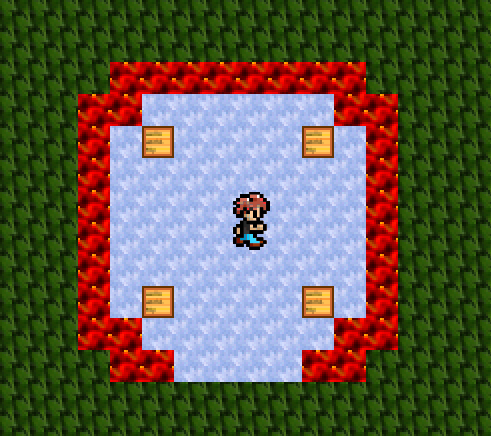
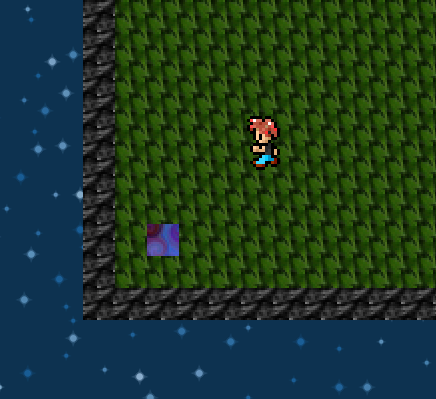

# JGame
## Development Build

#### Description:

JGame is a simple Javascript game I made that uses the HTML5 Canvas API.
The game can dynamically load maps from JSON files and implements basic colision detection.

 

#### Running:

Requirements:

- A modern browser that supports the HTML5 canvas API
- or [Electron](http://electron.atom.io/)

To play online, [click me](https://thebenperson.github.io/JGame).
To play offline, open index.html with your browser.
To play with Electron, run exec.sh.

#### Artwork:

- [isaiah658](https://openclipart.org/detail/215080/retro-character-sprite-sheet)
- [Feel The Vibe](http://thirdblack.tistory.com/entry/%EB%B0%A4%ED%95%98%EB%8A%98-%ED%8C%A8%ED%84%B4%EB%94%94%EC%9E%90%EC%9D%B8PNGSVG)
- [freddyh123](http://media.photobucket.com/user/freddyh123/media/mafia%20game%20icons/apoy1.gif.html)
- [codeinfernogames](http://opengameart.org/content/rotating-eyeball-animation)
